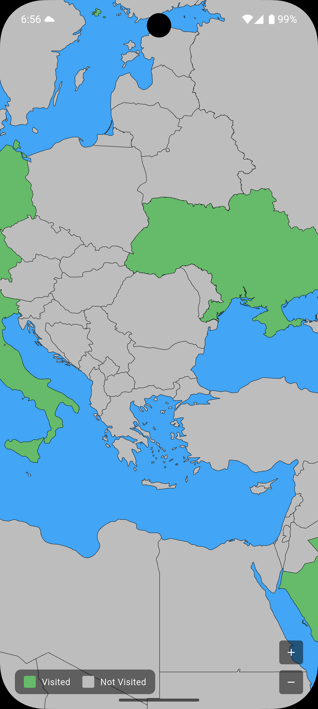

# Travel Map Tracker

A Flutter application that helps you track and visualize the countries you've visited around the world. The app displays an interactive world map where you can check in to countries and see your travel progress.

## Features

- **Interactive World Map**: Explore a detailed world map with country boundaries
- **Country Check-ins**: Tap on any country to check in and mark it as visited
- **Visual Progress**: Visited countries are highlighted in green, unvisited in grey
- **Location Services**: Automatically centers the map on your current location
- **Zoom Controls**: Built-in zoom in/out buttons for easy navigation
- **Country Information**: View country details with flags and check-in status
- **Travel Statistics**: Visual legend showing visited vs unvisited countries

## Screenshots

### Main Map View
*Add screenshot of the main map interface here*

### Country Dialog
*Add screenshot of the country check-in dialog here*

### Zoom Controls and Legend
*Add screenshot showing the zoom controls and legend overlay here*

## Getting Started

### Prerequisites
- Flutter SDK (3.0 or higher)
- Dart SDK
- Android Studio / VS Code with Flutter extensions

### Installation

1. Clone the repository:
```bash
git clone <repository-url>
cd map
```

2. Install dependencies:
```bash
flutter pub get
```

3. Run the app:
```bash
flutter run
```

### Permissions

The app requires location permissions to center the map on your current location. Grant location access when prompted for the best experience.

## Usage

1. **Explore the Map**: Use pinch-to-zoom, pan gestures, or the +/- buttons to navigate
2. **Check In**: Tap any country to open the check-in dialog
3. **Track Progress**: View your travel progress with the color-coded legend
4. **Current Location**: The app automatically centers on your location when opened

## Technical Details

- **Framework**: Flutter
- **Map Library**: Syncfusion Flutter Maps
- **Location Services**: Geolocator package
- **Flag Display**: Flag package for country flags
- **Data Source**: GeoJSON world map data

## Color Scheme

- **Visited Countries**: Green (`Colors.green.shade400`)
- **Unvisited Countries**: Grey (`Colors.grey.shade400`) 
- **Water/Ocean**: Blue (`Colors.blue.shade400`)
- **Borders**: Dark grey for better visibility

## Contributing

Feel free to submit issues and pull requests to improve the app!

## Screenshots


 




